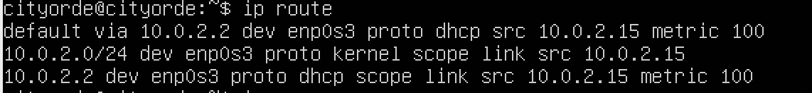
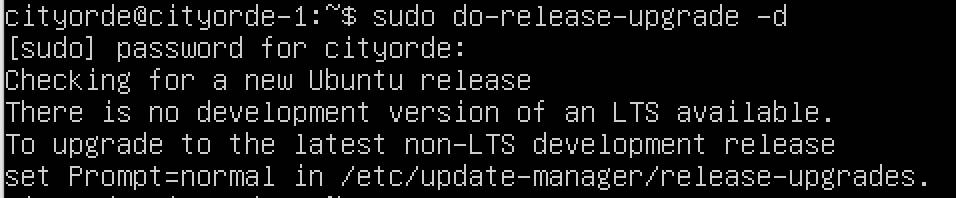
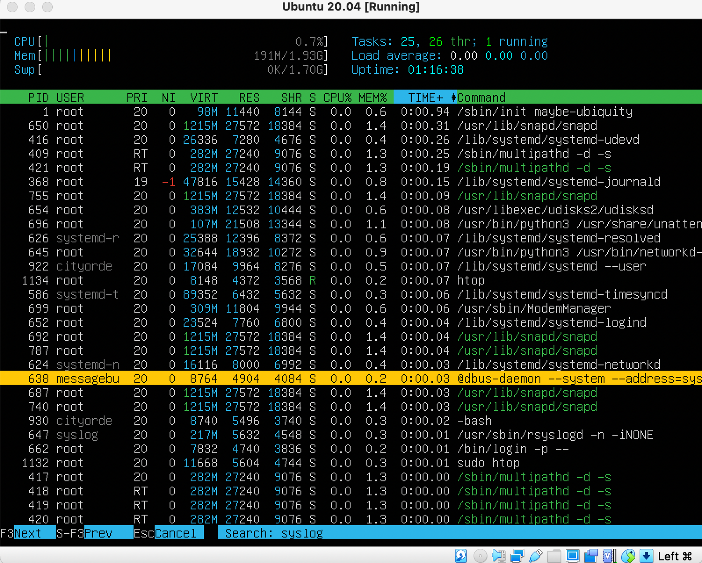
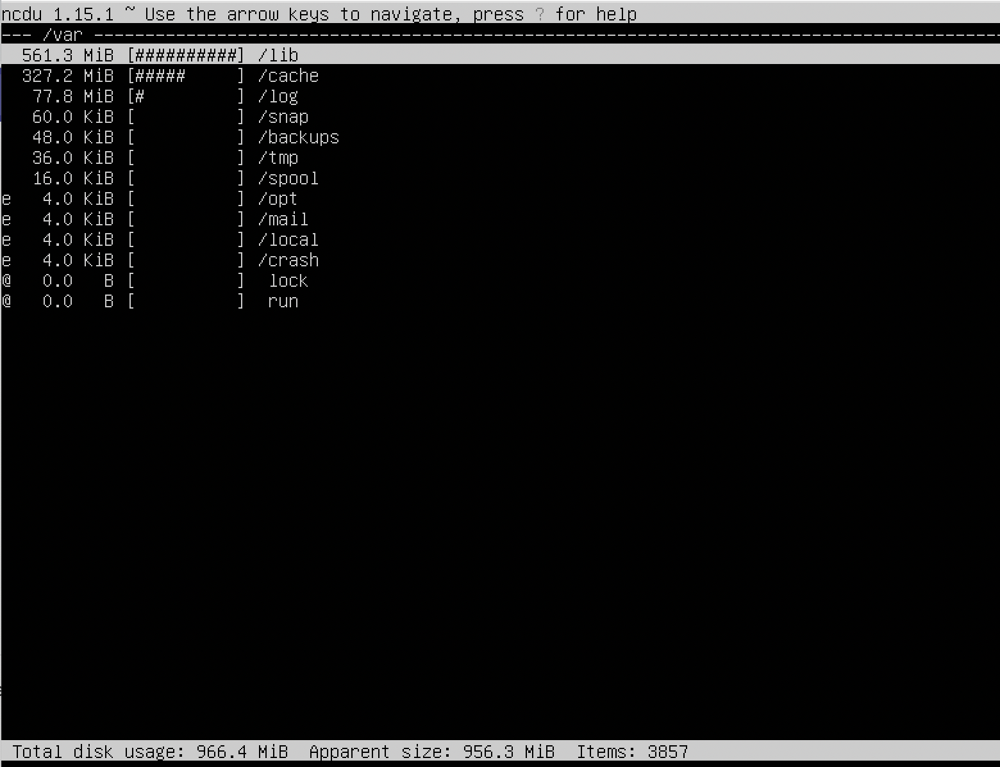

## Part 1. Установка ОС

Версия Ubuntu

## Part 2. Создание пользователя

Создание пользователя и добавление его в группу adm.

cat /etc/passwd

## Part 3. Настройка сети ОС

Задаем название машины cityorde-1

И проверяем его

Установливаем временную зону, соответствующую текущему местоположению

Выводим названия сетевых интерфейсов с помощью консольной команды

#### lo (loopback device) – виртуальный интерфейс, присутствующий по умолчанию в любом Linux. Он используется для отладки сетевых программ и запуска серверных приложений на локальной машине.

Получаем ip адрес устройства

#### DHCP (англ. Dynamic Host Configuration Protocol — протокол динамической настройки узла) — прикладной протокол, позволяющий сетевым устройствам автоматически получать IP-адрес и другие параметры, необходимые для работы в сети TCP/IP. Данный протокол работает по модели «клиент-сервер». Для автоматической конфигурации компьютер-клиент на этапе конфигурации сетевого устройства обращается к так называемому серверу DHCP и получает от него нужные параметры. Сетевой администратор может задать диапазон адресов, распределяемых сервером среди компьютеров. Это позволяет избежать ручной настройки компьютеров сети и уменьшает количество ошибок. Протокол DHCP используется в большинстве сетей TCP/IP.

Выводим на экран внешний ip-адрес шлюза (inet)

Выводим внутренний IP-адрес шлюза (default)

Задаем статичные настройки ip, gw, dnsб используя публичные DNS серверы

Применяем внесенные настройки

Перезагружаем виртуальную машину, проверяем сетевые настройки, пингуем 1.1.1.1 и ya.ru

## Part 4. Обновление ОС

Обновляем системные пакеты до последней версии. Повторно вводим команду - появляется сообщение об отсутствии обновлений

## Part 5. Использование команды sudo

##### sudo (англ. Substitute User and do, дословно «подменить пользователя и выполнить») — программа для системного администрирования UNIX-систем, позволяющая делегировать те или иные привилегированные ресурсы пользователям с ведением протокола работы. Основная идея — дать пользователям как можно меньше прав, при этом достаточных для решения поставленных задач.

##### Команда sudo предоставляет возможность пользователям выполнять команды от имени суперпользователя root, либо других пользователей. Правила, используемые sudo для принятия решения о предоставлении доступа, находятся в файле /etc/sudoers.

Разрешаем пользователю, созданному в Part 2, выполнять команду sudo и меняем hostname от его имени

## Part 6. Установка и настройка службы времени

Настраиваем службы автоматической синхронизации времениб выводим время часового пояса и команду timedatectl show

## Part 7. Установка и использование текстовых редакторов

##### Сохранение файлов

Vim. Для выхода с сохранением "esc :wq"

Nano. Для выхода с сохранением "Ctrl+O Ctrl+X"

Mcedit. Для выхода с сохранением "Option+2 Option+0"

##### Редактирование без изменений

Vim. Для выхода без сохранения "esc :q!"

Nano. Для выхода без сохранения "Ctrl+X n"

Vim. Для выхода без сохранения "Option+0 No"

##### Поиск по содержимому

Vim. Для поиска "/"

Nano. Для поиска "Ctrl+W"

Mcedit. Для поиска "Option+7 Find All"

##### Замена содержимого

Vim. Для замены ":%s/что меняем/на что меням/g"
(/g для замены всех вхождений)

Nano. Для замены "Ctrl+\ Искомое Замена Параметр (A - заменить все вхождения)"

Mcedit. Для замены "Option+4 Искомое Замена Параметр (All - заменить все вхождения"

## Part 8. Установка и базовая настройка сервиса SSHD

Устанавливаем службу SSHd и проверяем ее статус

Добавляем автостарт службы при загрузке системы

Перенастраиваем службу SSHd на порт 2022 (важно раскомментить строку)

Команда ps выводит список текущих процессов на вашем сервере, а опция -e показывает все процессы.
Утилита grep помогает фильтровать результаты из команды ps.

Выполняем команду netstat -tan

netstat выводит состояние TCP-соединений (как входящих, так и исходящих), таблицы маршрутизации, число сетевых интерфейсов и сетевую статистику по протоколам

-tan позволяет отображать все соединения, связанные с TCP

Мы видим протокол, размер очередей приема и получения (в байтах), локальный адрес, удаленный адрес (запись 0.0.0.0:* обозначает «любой IPv4 адрес с любого порта»), а также внутреннее состояние протокола.

## Part 9. Установка и использование утилит top, htop

Запускаем утилиту top

uptime - 26 минут

Количество авторизованных пользователей - 2

Общая загрузку системы - 0.04, 0.01, 0.00

Общее количество процессов - 101

Загрузка cpu - 0.0%

Загрузка памяти - 1976.0 / 1738.0

pid процесса занимающего больше всего памяти - 650

pid процесса, занимающего больше всего процессорного времени - 952

Запускаем улититу htop

Сортируем по PID

Сортируем по PERCENT_CPU

Сортируем по PERCENT_MEM

Сортируем по TIME

Отфильтровываем по процессу sshd

Ищем процесс syslog

Добавляем вывод hostname, clock и uptime

## Part 10. Использование утилиты fdisk

Получаем информацию о жестком диске, запустив команду sudo fdisk -l

Название жесткого диска - dev/sda

Размер жесткого диска - 10ГБ

Количество секторов - 20971520

Размер swap - 907МБ

## Part 11. Использование утилиты df

Запускаем команду df

Размер раздела - 9299276

Размер занятого пространства - 5176884

Размер свободного пространства - 3628416

Процент использования - 59%

Единица измерения в выводе - килобайты

Запускаем команду df -Th

Размер раздела - 8.9ГБ

Размер занятого пространства - 5.0ГБ

Размер свободного пространства - 3.5ГБ

Процент использования - 59%

Тип файловой системы корневого раздела - ext4

## Part 12. Использование утилиты du

Запускаем команду du и выводим в байтах размер папок

/home

/var

/var/log

Выводим размер всего содержимого в /var/log (не общее, а каждого вложенного элемента, используя *)

## Part 13. Установка и использование утилиты ncdu

Устанавливаем утилиту ncdu и выводим размер папок

/home

/var

/var/log

## Part 14. Работа с системными журналами

Открываем для просмотра /var/log/dmesg, /var/log/syslog, /var/log/auth.log

Время последней успешной авторизации - 13:38:35

Имя пользователя - cityorde-1

Метод входа в систему - login

Перезапускаем службу SSHd

Ищем сообщение о рестарте службы в /var/log/syslog

## Part 15. Использование планировщика заданий CRON

Используя планировщик заданий, запускаем команду uptime через каждые 2 минуты

Находим в системных журналах строчки о выполнении

Выводим на экран список текущих заданий для CRON

Удаляем все задания из планировщика заданий

